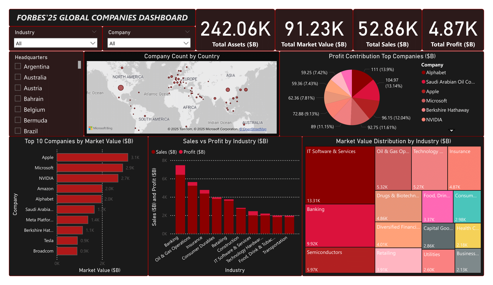

# 📊 Forbes Global Companies 2025 Dashboard

**An interactive Power BI Dashboard providing comprehensive insights into the world's largest public companies.**

## 🌟 Dashboard Preview

Here's the screenshot of the Dashboard:



## 📈 Executive Summary

The 2025 Forbes Global 2000 landscape reveals a tale of two economies: **technology dominance** and **traditional financial strength**. The US leads with 612 companies (30.6%), followed by China with 275 (13.8%). Technology giants command unprecedented market valuations, while banking and energy sectors generate substantial profits. Geographic concentration remains high, with the top 10 countries representing **74%** of all listed companies, highlighting persistent global economic disparities.

## 🎯 Key Metrics at a Glance

| Metric | Value |
|--------|-------|
| **Total Sales** | $52.86 trillion |
| **Total Profit** | $4.87 trillion |
| **Total Assets** | $242.06 trillion |
| **Total Market Value** | $91.23 trillion |
| **Companies Analyzed** | 2,000 |

## 🏆 Top Performers

### 💰 Market Value Leaders
| Rank | Company | Market Value |
|------|---------|-------------|
| 1 | Apple | $3.1T |
| 2 | Microsoft | $2.9T |
| 3 | NVIDIA | $2.7T |
| 4 | Amazon | $2.0T |
| 5 | Alphabet | $2.0T |
| 6 | Saudi Arabian Oil Co. | $1.7T |
| 7 | Meta Platforms | $1.4T |
| 8 | Berkshire Hathaway | $1.1T |
| 9 | Tesla | $0.9T |
| 10 | Broadcom | $0.9T |

### 📊 Profit Champions
| Company | Profit | % of Total |
|---------|--------|-----------|
| Alphabet | $111.0B | 13.9% |
| Saudi Arabian Oil Co. | $105.0B | 13.14% |
| Apple | $96.2B | 12.04% |
| Microsoft | $92.8B | 11.61% |
| Berkshire Hathaway | $89.0B | 11.15% |

## 🌍 Geographic Distribution

| Country | Companies | Percentage | Flag |
|---------|-----------|------------|------|
| United States | 612 | 30.6% | 🇺🇸 |
| China | 275 | 13.8% | 🇨🇳 |
| Japan | 180 | 9.0% | 🇯🇵 |
| India | 70 | 3.5% | 🇮🇳 |
| United Kingdom | 68 | 3.4% | 🇬🇧 |
| South Korea | 62 | 3.1% | 🇰🇷 |
| Canada | 60 | 3.0% | 🇨🇦 |
| Germany | 49 | 2.5% | 🇩🇪 |
| France | 47 | 2.4% | 🇫🇷 |
| Switzerland | 45 | 2.3% | 🇨🇭 |

## 🏭 Industry Analysis

### Market Value by Sector
| Industry | Market Value |
|----------|-------------|
| IT Software & Services | $13.31T |
| Banking | $9.92T |
| Semiconductors | $5.97T |
| Oil & Gas Operations | $5.32T |
| Technology Hardware | $5.27T |
| Insurance | $4.87T |
| Drugs & Biotechnology | $4.86T |

## 🔍 Key Insights

### 🌎 Geographic Trends
- **🇺🇸 US Dominance**: 612 companies represent nearly one-third of all Global 2000 companies
- **🌏 Asia Rising**: China, Japan, India, and South Korea collectively account for 587 companies (29.4%)
- **🇪🇺 European Strength**: UK, Germany, France, and Switzerland maintain significant presence with 209 companies

### 🏢 Industry Performance
- **💻 Tech Premium**: Technology companies command disproportionately high market valuations
- **🏦 Banking Profitability**: Traditional banking generates substantial profits through established models
- **⚡ Energy Resilience**: Oil & gas operations demonstrate continued profitability despite market volatility

### 📈 Market Dynamics
- **🎯 Concentration**: Top 10 companies represent $17.2T in market value (32.5% of total)
- **💡 Efficiency**: Technology firms show higher profit margins vs. asset-heavy industries
- **🗺️ Specialization**: Tech clusters in US/China; financial services show broader distribution

## ✨ Dashboard Features

### 🎛️ Interactive Controls
- **🌍 Geographic Filters**: Filter by any of countries
- **🏭 Industry Filters**: Explore industry sectors
- **📊 Cross-filtering**: Click any visual to filter related charts
- **🔍 Drill-down**: Explore data at multiple levels of detail

### 📋 Analytical Views
- Top companies by market value, sales, profit, and assets
- Geographic distribution with interactive world map
- Industry performance comparisons
- Profit margin analysis
- Sales vs profit correlations

## 🚀 Getting Started

### Prerequisites
- **Power BI Desktop** (latest version recommended)
- **Windows OS** (for full functionality)
- **2GB RAM** minimum for smooth performance

### Installation Steps

1. **Clone the repository**
   ```bash
   git clone https://github.com/adeel-iqbal/forbes-global-companies-dashboard-powerbi.git
   ```

2. **Navigate to project directory**
   ```bash
   cd forbes-global-companies-dashboard-powerbi
   ```

3. **Open the dashboard**
   - Launch Power BI Desktop
   - Open the `.pbix` file
   - Wait for data to load (may take 30-60 seconds)

4. **Start exploring!**
   - Use filters to explore specific regions or industries
   - Hover over charts for detailed tooltips
   - Click visual elements to cross-filter other charts

## 🛠️ Technical Stack

| Technology | Purpose |
|------------|---------|
| **Power BI Desktop** | Primary development platform |
| **DAX** | Advanced calculations and measures |
| **Power Query** | Data transformation and modeling |
| **M Language** | Data source connections |

## 📊 Data Source

**Forbes Global 2000 (2025 Edition)**
- Comprehensive ranking of world's largest public companies
- Based on four key metrics: Sales, Profits, Assets, Market Value
- Covers 2,000 companies across 60+ countries
- Updated annually with latest financial data

## 👨‍💻 Author

**Adeel Iqbal**
- 🌐 GitHub: [@adeel-iqbal](https://github.com/adeel-iqbal)
- 💼 LinkedIn: [Connect with me](https://linkedin.com/in/adeeliqbalmemon)
- 📧 Email: [Get in touch](mailto:adeelmemon096@yahoo.com)

## 🙏 Acknowledgments

- **Forbes** for providing comprehensive Global 2000 data
- **Microsoft** for the powerful Power BI platform
- **Power BI Community** for inspiration and best practices

---

<div align="center">

**⭐ If you found this dashboard helpful, please give it a star! ⭐**

</div>
